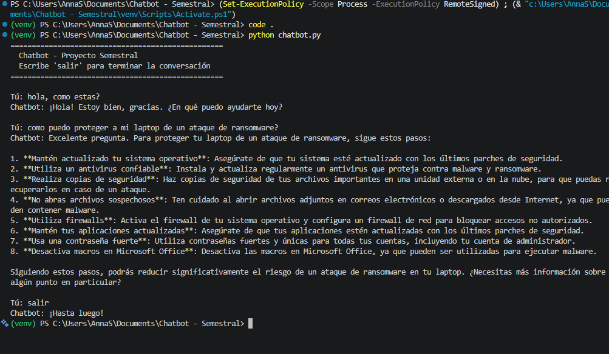

# Chatbot (Lotus) - Proyecto Semestral

Chatbot de consola hecho en Python usando la API de Groq (modelo `llama-3.3-70b-versatile`, compatible con el SDK de OpenAI).

## Requisitos

- Python 3.12
- Una API key gratis de Groq (https://console.groq.com/keys)

## Instalación

```bash
# Clonar el repositorio
git clone https://github.com/TU_USUARIO/chatbot-semestral.git
cd chatbot-semestral

# Crear entorno virtual
python -m venv venv

# Activar entorno virtual
venv\Scripts\activate      # Windows
source venv/bin/activate   # Mac/Linux

# Instalar dependencias
pip install -r requirements.txt
```

## Configuración

1. Copia `.env.example` a `.env`
2. Reemplaza `tu_api_key_aqui` con tu API key real de Groq (empieza con `gsk_...`)

## Uso

```bash
python chatbot.py
```

Escribe tus mensajes y presiona Enter. Escribe `salir` para terminar.

## Demo funcionando

Captura del chatbot corriendo, respondiendo preguntas y terminando con el comando `salir`:



## Estructura del proyecto

```
chatbot-semestral/
├── chatbot.py       # Código principal
├── requirements.txt # Dependencias
├── .env.example     # Plantilla de variables de entorno
├── .gitignore        # Archivos que no se suben a git
├── README.md         # Este archivo
└── screenshots/
    └── demo.png      # Captura del chatbot funcionando
```
